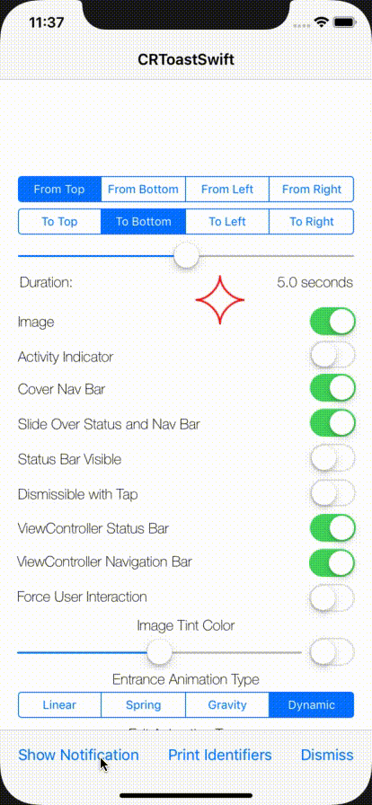

# CRToastSwift

## Origins

I've always like the care and effort put into [CRToast](https://github.com/cruffenach/CRToast). The documentation and the concepts are complete over there, so make sure to read it first.

Again, [go read the documentation over there](https://github.com/cruffenach/CRToast).

## How to use in a project

Right now, no Cocoapods or Carthage support because I wanted to see if I could get by with using only Swift Package Manager.

To include in your project, use a git submodule, then generate the project using `swift package generate-xcodeproj`, and include that as a dependency. Don't forget to add it to your target dependencies, your link phase, and your copy phase.

## Porting to Swift

A lot of the porting effort was put into the very different way of handling types. Objective-C's lax rules regarding types made checking values and using "similar but not equal" types of values was rejected wholesale by the Swift compiler.

Feel free to compare the two repositories and see the differences. I have tried to keep as much as possible of the original structure and naming conventions.

## The Extra Bit

Because I'm fascinated with obscure iOS features that seem too powerful to be true, I have decided to include a new "dynamic" type of notification: you set it up with `UIView` objects that mean something to the alert text, and when the notification falls down, it will rebound on them, highlighting what the user probably didn't read in the text.

For instance, say you have a standard login view, with two text fields and a check box to agree to the TOS. If the user leaves an important item empty (login, password, or checkbox), the alert will collide with it on its way out, but *pass through* the ones that are correctly filled.

